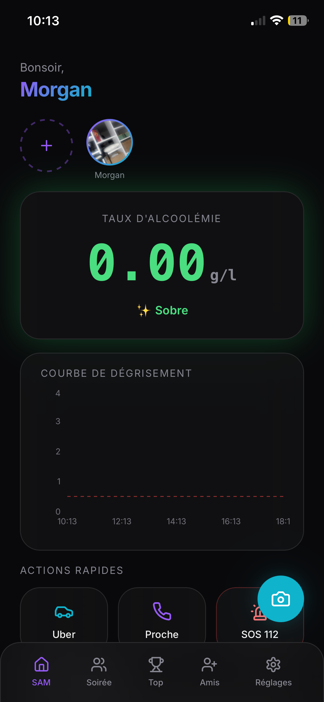

# ✅ Quick Start Guide - Night Watch Landing Page

## 🚀 C'est parti en 2 minutes!

### Étape 1: Accédez à votre landing page

**En local (Développement):**
```
http://localhost:8000
```

**En production (GitHub Pages):**
```
https://username.github.io/nightwatch-landing/
```

---

## 🎯 Vérification Rapide

### ✅ Le site s'affiche correctement?

Checklist visuelle:
- [ ] Logo Night Watch visible en haut
- [ ] Hero section avec texte "Partagez vos soirées en sécurité"
- [ ] Mockup iPhone avec votre photo (IMG_0831.PNG) visible
- [ ] Bouton "📥 Installer Night Watch" visible et cliquable
- [ ] Section Features avec 8 cartes d'icônes
- [ ] Section FAQ avec questions dépliables
- [ ] Section Testimonials avec 3 avis
- [ ] Footer avec liens sociaux

### ✅ Le design est responsive?

Testez sur mobile:
```
Ouvrez: http://localhost:8000
Appuyez: Ctrl+Shift+M  (DevTools responsive mode)
Sélectionnez: iPhone 12, Pixel 5, iPad, etc.

✓ Texte lisible sans zoom
✓ Boutons accessibles au doigt
✓ Images redimensionnées correctement
✓ Pas de scroll horizontal
✓ Navigation reste accessible
```

### ✅ L'installation PWA fonctionne?

Sur desktop (Chrome/Edge):
```
1. Ouvrez http://localhost:8000
2. Cherchez l'icône "Install" dans la barre d'adresse
   (ou console Dev: beforeinstallprompt event)
3. Cliquez le bouton "📥 Installer Night Watch"
4. Confirmez l'installation
5. L'app s'installe depuis https://social-glow-meter.lovable.app/

✓ Le prompt d'installation apparaît
✓ Vous êtes redirigé vers l'app réelle
```

Sur iOS:
```
1. Ouvrez http://localhost:8000 dans Safari
2. Cliquez le bouton "Partage" (en bas)
3. Cliquez "Sur l'écran d'accueil"
4. Cliquez "Ajouter"
5. L'app est créée directement vers la PWA

✓ Raccourci créé sur l'écran d'accueil
```

### ✅ La FAQ fonctionne?

Testez l'interactivité:
```
1. Cliquez sur une question FAQ
2. La réponse devrait se déployer
3. Cliquez sur une autre question
4. La première devrait se fermer (accordéon)
5. Appuyez sur Entrée/Espace si focalisé

✓ Animations fluides
✓ Accordéon fonctionne
✓ Texte lisible
```

### ✅ Les animations fonctionnent?

Testez au défilement:
```
1. Rechargez la page
2. Scrollez vers le bas lentement
3. Les cartes Features devraient:
   - Apparaître progressivement (fade-in)
   - Avoir un décalage dans l'animation (stagger)
   - S'élever légèrement (bounce effect)

✓ Animations fluides (pas de sautillements)
✓ Performance >= 60 FPS
```

---

## 🔍 Vérification de la Console

Ouvrez DevTools (F12) et allez dans **Console** pour vérifier:

### Messages normaux (OK)
```
[Service Worker] Installation en cours...
[Service Worker] Cache créé: nightwatch-landing-v1
[Service Worker] Fichiers statiques mis en cache
Page load time: 245ms
Device type: mobile
PWA Support: {serviceWorker: true, cacheAPI: true, ...}
```

### Erreurs à ignorer
```
❌ Pas dans ce guide mais ne gêne pas le fonctionnement
```

### Erreurs à corriger
```
❌ Uncaught TypeError: Can't find manifest.json
   → Vérifiez que manifest.json existe dans le repo

❌ Uncaught SyntaxError in script.js
   → Vérifiez la syntaxe JavaScript (manque point-virgule?)

❌ Failed to load image IMG_0831.PNG
   → Vérifiez le fichier IMG_0831.PNG existe
   → Vérifiez le chemin dans index.html: ./IMG_0831.PNG
```

---

## 📊 Vérification Lighthouse

Testez la performance, accessibilité et SEO:

### Dans DevTools
```
1. Ouvrez DevTools (F12)
2. Allez dans l'onglet "Lighthouse"
3. Cliquez "Analyze page load"
4. Attendez ~30 secondes
5. Vérifiez les scores:
   - Performance: > 90 ✅
   - Accessibility: > 90 ✅
   - Best Practices: > 85 ✅
   - SEO: > 90 ✅
```

### Si scores bas:
- 📸 Compressez IMG_0831.PNG davantage
- 🎨 Vérifiez le contraste des couleurs
- 🎯 Ajoutez des labels ARIA si needed
- ⚡ Minimisez les fichiers CSS/JS

---

## 🌍 Vérification Avant Déploiement GitHub Pages

Avant de pousser vers GitHub:

```bash
# 1. Vérifiez tous les fichiers sont là
ls -la

# Résultat: 
# index.html              ✅
# styles.css              ✅
# script.js               ✅
# manifest.json           ✅
# service-worker.js       ✅
# IMG_0831.PNG            ✅
# README.md               ✅
# GITHUB_PAGES_SETUP.md   ✅
# TECHNICAL_NOTES.md      ✅
# .gitignore              ✅

# 2. Architecture sans dépendances
ls node_modules  # ❌ Ne doit PAS exister

# 3. Test local final
python3 -m http.server 8000
# Visitez http://localhost:8000
# Testez tout (voir checklist au-dessus)
```

---

## 📤 Déploiement sur GitHub Pages

### Commandes Git

```bash
# 1. Navigate to project
cd /Users/morganreichert/Desktop/landing\ page\ nightwatch

# 2. Initialize git (si pas déjà fait)
git init

# 3. Add all files
git add .

# 4. Commit
git commit -m "Initial commit: Night Watch Landing Page PWA"

# 5. Add GitHub remote (remplacez <username>)
git remote add origin https://github.com/<username>/nightwatch-landing.git

# 6. Rename branch (GitHub prefer main)
git branch -M main

# 7. Push to GitHub
git push -u origin main

# Résultat:
# ✅ Repo créé sur GitHub
# ✅ Fichiers pushés
# ✅ Pages sera auto-déployé
```

### Vérifier le déploiement

```
Allez à: https://github.com/<username>/nightwatch-landing/
Allez aux: Settings > Pages
Attendez quelques secondes...
Voir: "Your site is published at https://<username>.github.io/nightwatch-landing/"
```

**URL Finale:**
```
https://<username>.github.io/nightwatch-landing/
```

---

## 🎨 Personnalisation Rapide

### Changer les couleurs

**Ouvrez:** `styles.css`

**Cherchez:**
```css
:root {
    --primary: #1e3a8a;        ← Bleu Night Watch
    --accent: #06b6d4;         ← Cyan
    --danger: #ef4444;         ← Rouge
    /* ... */
}
```

**Changez les valeurs hex:**
```css
--primary: #0066ff;  /* Votre couleur */
--accent: #ff6b00;   /* Votre couleur */
```

### Changer les textes

**Ouvrez:** `index.html`

**Cherchez et changez:**
```html
<h1>Partagez vos soirées en sécurité</h1>
→ <h1>Votre nouveau titre</h1>

<p class="hero-subtitle">Stay Sharp. Stay Safe. 🌙</p>
→ <p class="hero-subtitle">Votre nouveau tagline</p>
```

### Changer l'image du hero

**Remplacez:** `IMG_0831.PNG` par votre nouvelle image

**Ou changez le src dans `index.html`:**
```html

→ 
```

### Changer les liens externes

**Ouvrez:** `index.html` ou `script.js`

**Cherchez et changez:**
```javascript
// script.js - Redirection app
window.location.href = 'https://social-glow-meter.lovable.app/';
→ window.location.href = 'https://votre-app.com/';

// manifest.json
"start_url": "https://social-glow-meter.lovable.app/",
→ "start_url": "https://votre-app.com/",
```

---

## 🚨 Troubleshooting Rapide

### Le site ne s'affiche pas?
```
✅ Le serveur tourne-t-il? (python3 -m http.server 8000)
✅ Avez-vous accès à http://localhost:8000?
✅ Vérifiez la console DevTools pour erreurs
```

### L'image du hero ne s'affiche pas?
```
✅ IMG_0831.PNG existe dans le même dossier que index.html?
✅ Le chemin est correct: ./IMG_0831.PNG?
✅ Le filename est sensible à la casse?
```

### La FAQ ne fonctionne pas?
```
✅ JavaScript est activé?
✅ Vérifiez console DevTools pour erreurs
✅ Rechargez la page (Ctrl+Shift+R hard refresh)
```

### Le PWA install button ne marche pas?
```
✅ Êtes-vous en HTTPS (local ne marche pas toujours)?
✅ Manifest.json est correct et accessible?
✅ Testez sur Chrome/Edge (autres navigateurs ont limitations)
```

### Le site est lent?
```
✅ Vérifiez Lighthouse scores
✅ Compressez IMG_0831.PNG (ImageOptim ou TinyPNG)
✅ Vérifiez aucune requête externe bloquante
✅ Videz le cache: Hard refresh (Ctrl+Shift+R)
```

---

## 📱 Tester sur Appareil Réel

### Tester en local sur votre téléphone

```bash
# 1. Trouvez votre IP locale (sur Mac)
ifconfig | grep "inet "

# Résultat: 192.168.1.100 (par exemple)

# 2. Démarrez le serveur local
python3 -m http.server 8000

# 3. Sur votre téléphone, visitez:
http://192.168.1.100:8000

# 4. Testez:
- Responsivité
- Interactions tactiles
- Installation PWA
```

### Tester sur dispositif en production (GitHub Pages)

```
Visitez: https://<username>.github.io/nightwatch-landing/

Sur téléphone:
- Ouvrez l'URL dans Chrome/Safari
- Tappez le bouton "Install"
- Pour iOS: Menu Partage > Sur l'écran d'accueil
- Testez l'installation et redirection
```

---

## ✨ Checklist Avant Lancement

- [ ] Site s'affiche correctement (visuellement)
- [ ] Responsive design OK (mobile, tablet, desktop)
- [ ] Tous les liens fonctionnent
- [ ] PWA install fonctionne
- [ ] FAQ accordéon fonctionne
- [ ] Pas d'erreurs console
- [ ] Lighthouse scores > 90
- [ ] Images optimisées
- [ ] Meta tags corrects
- [ ] GitHub repo créé et poussé
- [ ] GitHub Pages activé
- [ ] URL finale accessible et remportée

---

## 🎉 Succès!

Votre landing page Night Watch est prête! 🚀

**Prochaines étapes:**
1. ✅ Partager l'URL: `https://username.github.io/nightwatch-landing/`
2. 📢 Promouvoir sur réseaux sociaux
3. 📊 Ajouter Analytics (optionnel)
4. 🔄 Maintenir et mettre à jour récent contenu

---

**Questions?**

Consultez:
- [README.md](./README.md) - Documentation générale
- [TECHNICAL_NOTES.md](./TECHNICAL_NOTES.md) - Details techniques
- [GITHUB_PAGES_SETUP.md](./GITHUB_PAGES_SETUP.md) - Déploiement

---

**Stay Sharp. Stay Safe.** 🌙

Dernière mise à jour: 20 Mars 2026
